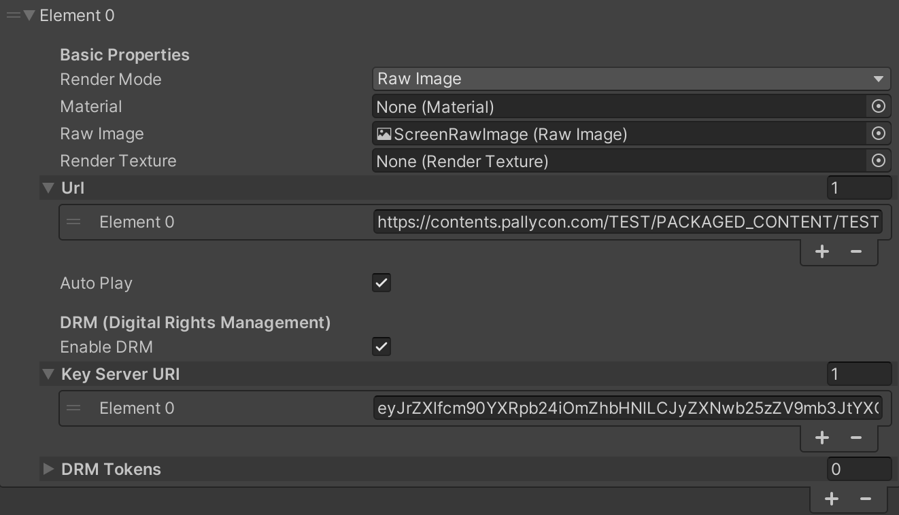

# DRM

In the video streaming industry, the DRM (Digital Rights Management) makes possible a secure distribution of contents over the network.
Encrypted content is prepared using an encryption server and stored in a content library. The encrypted content is streamed or downloaded from the content library to client devices via content servers. Licenses to view the content are obtained from the License Server.

The HISPlayer Unity Video Player SDK for iOS uses [Inka](https://pallycon.com/docs/en/) DRM system called NGC(Netsync Content Guard), which makes it easier for customers to integrate it in their media service apps or games.

When using DRM is important to disable bitcode from your XCode project for your targets. You can do it from **Project Settings > Build Settings > Enable Bitcode = NO**

Use **Multi Stream Properties** to set the DRM fields. It is possible to add license keys both in the editor and from code (see AddStream and AddVideoContent in [HISPlayer API](/hisplayer-api.md) for more details):

* **Enable DRM**: Check to enable DRM usage. When enabled, there should be one license key URI per content URL even though the content is clear (empty license key URI). This field will have effect during the AddVideoContent functionality.
* **Key Server URI**: Add license URLs for DRM-protected contents. There must be one license key URL per content URL when the “Enable DRM” is checked.
* **DRM Tokens**: If your key server needs more information, add drm tokens for DRM-protected contents alongside the respective Key Server URI. There must be one token per key server uri when the “Enable DRM” is checked. The tokens are composed of a Key and a Value. This field will have effect during the AddVideoContent functionality.

The below image shows an example of the usage of the DRM fields in the editor:
* There is 1 content URL: https://contents.pallycon.com/TEST/PACKAGED_CONTENT/TEST_SIMPLE/sintel-trailer.mp4.ncg
* There is 1 element in the Key Server URI list. This element is a token which will get the license from the content URL above. This whole process is managed by HISPlayer along with the NCG SDK.

