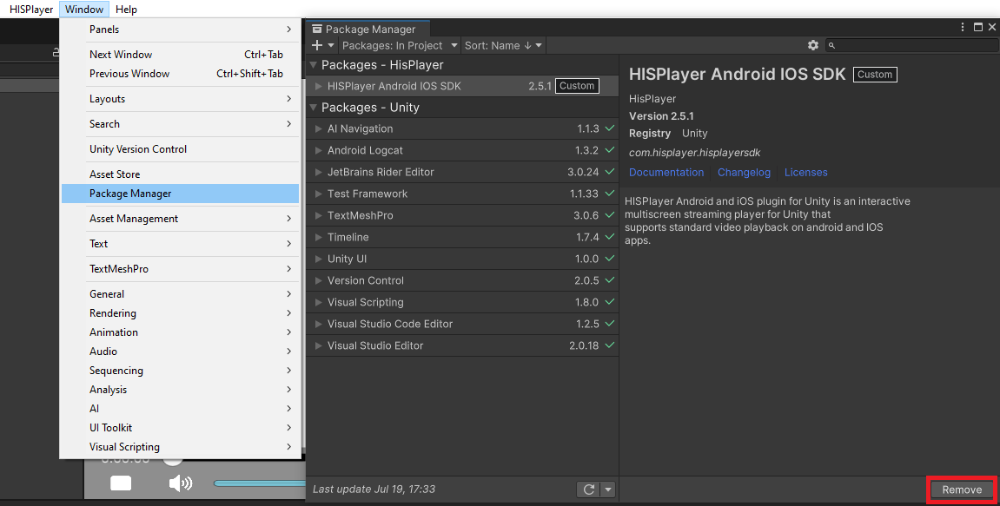
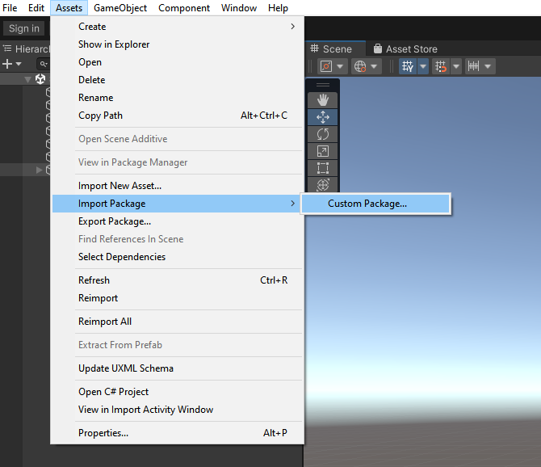
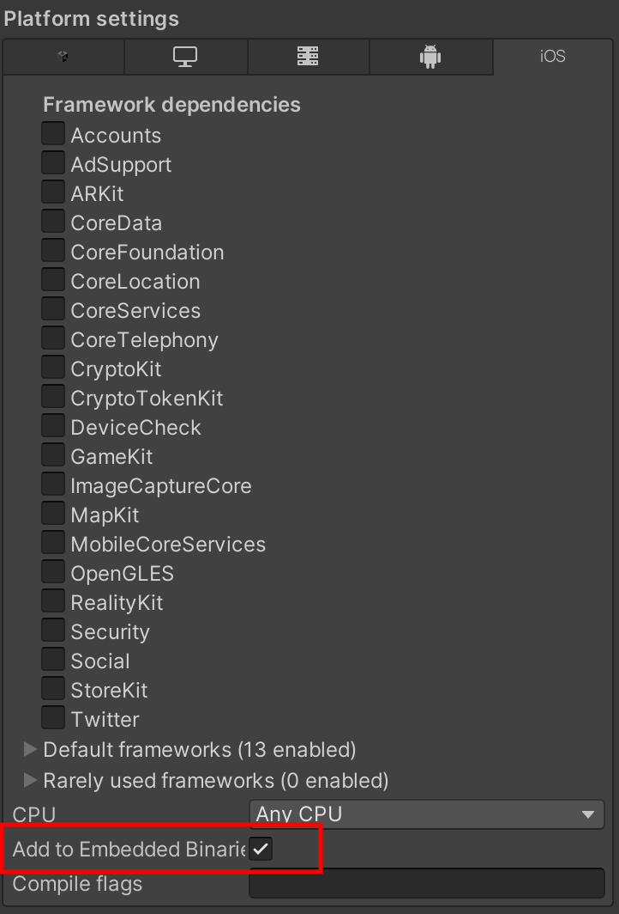
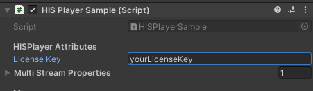

# Update the SDK

Through this guide, you will be introduced how to update the SDK if you already have installed the SDK previously.

## Remove Old Package

Remove the previous HISPlayer Android / iOS SDK package from Unity Package Manager

**Window > Package Manager > Packages - HISPlayer > HISPlayer Android IOS SDK > Remove**

 

## Import New package

Importing the new package is the same as importing other normal packages in Unity. 
Select the package of HISPlayer SDK and import it.

**Assets > Import Package > Custom Package**

 

## Configure Unity for iOS
It is necessary to set the **Color Space** as **Linear**.

To set it up go to **Project Settings > Player Settings > Other Settings**

Also, make sure that the **HISPlayeriOS.framework** file, located in **Packages > HISPlayer iOS SDK > HISPlayer > Plugins > iOS**, has the **Add to Embedded Binaries** set to true.

## Update License Key
Input the license key that is associated with the SDK through HISPlayer properties. If the license key is not valid, the player won't work and will throw an error message.

